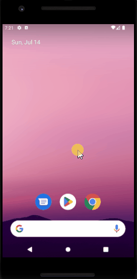

<h1 align="center"> #NLW16-Journey </h1>

  Projeto foi desenvolvido em evento gratuíto da <a href="https://rocketseat.com.br">Rocketseat</a> 💜. Nele, criamos um aplicativo mobile para planejamento de viagens utilizando React Native.

  <a href="#tecnologias">Tecnologias</a>&nbsp;&nbsp;&nbsp;|&nbsp;&nbsp;&nbsp;
  <a href="#projeto">Projeto</a>&nbsp;&nbsp;&nbsp;|&nbsp;&nbsp;&nbsp;
  <a href="#licenca">Licença</a>&nbsp;&nbsp;&nbsp;|&nbsp;&nbsp;&nbsp;
  <a href="#demonstracao">Demonstração</a>

  

## 🚀 Tecnologias

Esse projeto foi desenvolvido com as seguintes tecnologias:

-  Expo Go
-  TypeScript
-  TailwindCSS
-  Axios

 

  
  
  
  

  

## 💻 Projeto

O plann.er é um aplicativo feito para criar e organizar viagens de uma forma muito simples e intuitiva. Ele fornece recursos para organizar o cronograma da viagem e compartilhar links úteis para os participantes.

## Licença

Esse projeto está sob a licença MIT.

## Demonstração

 

  

---
